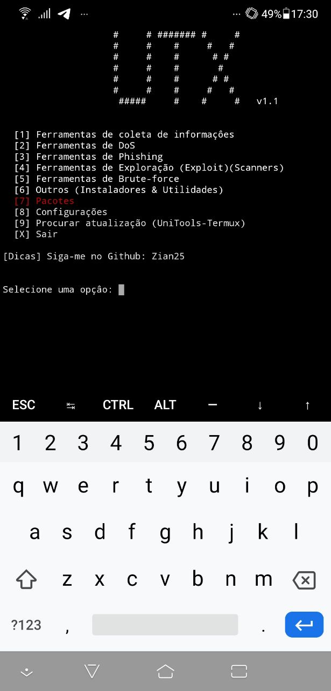

[]()
[]()
[]()
[]()


# UniTools-Termux
Instalador de ferramentas hacking para termux 


Hacking tool installer for Termux 


Instalador de herramientas de hacking para Termux 


It contains English translation!


¡Contiene traducción al español!

Como usar?


```
pkg install git
pkg install python
git clone https://github.com/Zian25/UniTools-Termux
cd UniTools-Termux
python3 utx.py
```

# Desktop (Linux)
Confira a versão Desktop feita por <a href="https://github.com/Ahosall">Ahosall</a>

Desktop: <a href="https://github.com/Ahosall/UniTools">UniTools</a>

# Imagem



